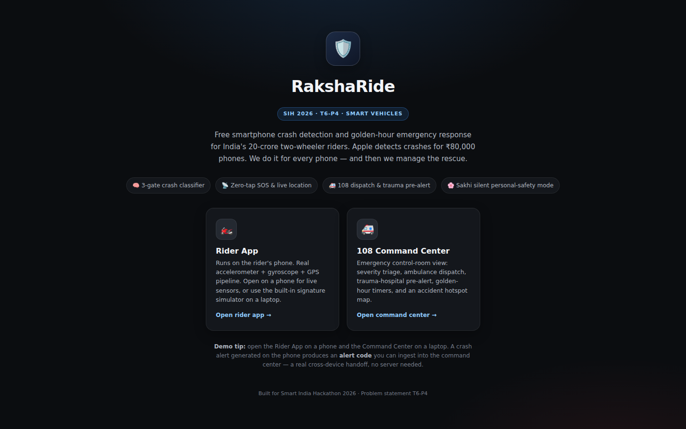
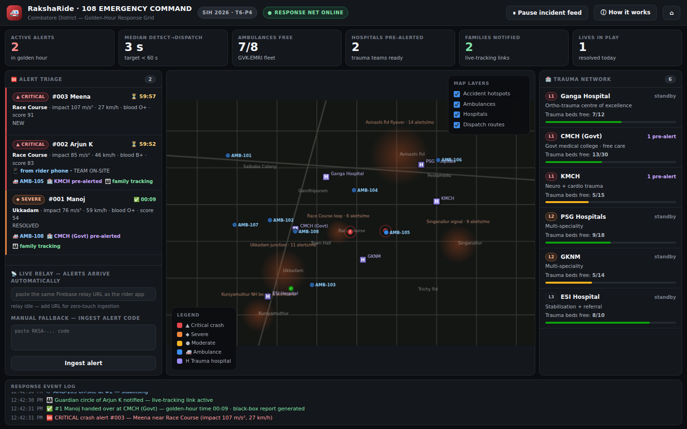
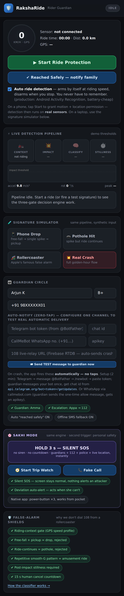
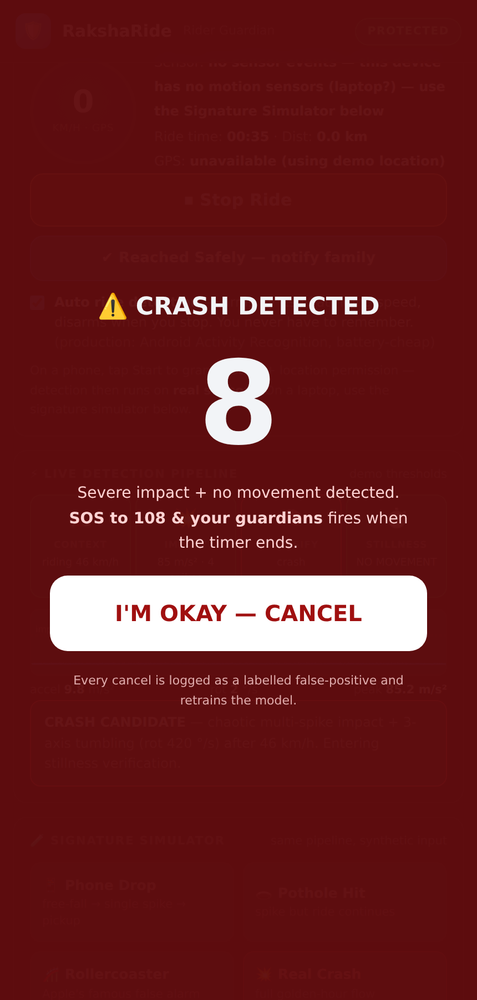
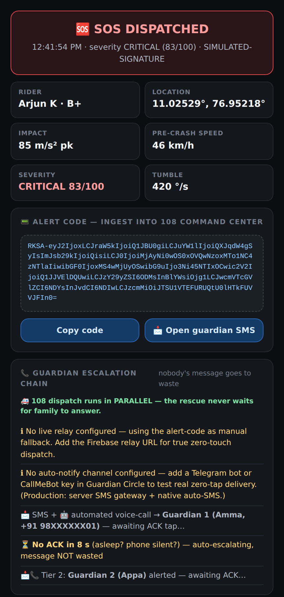

# 🛡️ RakshaRide

**Free smartphone crash detection and golden-hour emergency response for two-wheeler riders.**

> Built for Smart India Hackathon 2026 · Problem statement T6-P4 (Smart Vehicles)

Apple detects crashes on ₹80,000 phones. RakshaRide does it on *every* phone using the accelerometer, gyroscope and GPS that are already there — and then manages the rescue end-to-end: guardian notification, 108 ambulance dispatch, trauma-hospital pre-alert and live location, all with **zero taps** from a rider who may be unconscious.

The whole prototype runs in the browser with no build step and no backend. Open it on a phone for **real sensors**, or on a laptop with the built-in **signature simulator**. Both feed the *same* decision code.

---

## 📸 Screenshots

| Landing | 108 Command Center |
|---|---|
|  |  |

| Rider app | Crash countdown | SOS dispatched |
|---|---|---|
|  |  |  |

---

## ✨ What it does

| Module | Highlights |
|---|---|
| **Rider App** (phone) | Real `DeviceMotion` + `Geolocation` pipeline · three-gate crash classifier · live G-force chart · auto ride detection (arms at riding speed, disarms when parked) · 10 s cancel countdown with siren + vibration · SOS screen with encoded alert code |
| **Signature Simulator** | Phone drop, pothole, rollercoaster and real-crash signatures injected into the *identical* pipeline — demonstrates why each false alarm is rejected |
| **Guardian Circle** | Zero-tap auto-notify over Telegram Bot API or CallMeBot WhatsApp · Telegram native **live-location streaming** · SMS deep-link fallback · acknowledgement-driven escalation chain (Guardian 1 → Guardian 2 → 112 + nearby riders) |
| **Sakhi Mode** | Silent hold-to-SOS for personal safety (no siren, no countdown) · Trip Watch with route-deviation auto-alert · Fake incoming call |
| **108 Command Center** (laptop) | Severity triage queue with golden-hour timers · canvas map with accident hotspots, 8-ambulance fleet, 6-hospital trauma network and dispatch routes · nearest-free-ambulance + severity/bed-aware hospital matching · KPI tiles · response event log |
| **Cross-device handoff** | Alert code (`RKSA-…`, base64 JSON) can be pasted from phone to command center, or auto-relayed through a Firebase Realtime Database URL for true zero-touch ingestion |

---

## 🧠 How the classifier decides

The engine never judges an impact alone — it judges the story around it. Three gates must all agree before the countdown starts.

```
Gate 1  RIDING CONTEXT   GPS shows sustained vehicle speed → detector armed
Gate 2  IMPACT SIGNATURE features = [peakG, spikeCount, freefall_ms, rotationEnergy, ΔGPS_speed]
Gate 3  STILLNESS        5 s of no motion after impact → countdown → SOS
```

| Event | Signature | Verdict |
|---|---|---|
| Phone drop | free-fall ~0 g → one clean spike → low rotation → pickup motion | REJECT |
| Pothole / hard brake | single spike, GPS speed continues | REJECT |
| Rollercoaster | repetitive smooth G-waves, no road context | REJECT (no countdown) |
| Crash | deceleration to 0 + multiple chaotic spikes + 3-axis tumbling + stillness | ESCALATE |

Severity feeds dispatch priority and hospital matching:

```
severity = 35·(preSpeed/60) + 30·(peakG/120) + 20·(rotE/400) + 15  →  CRITICAL ≥70 · SEVERE ≥45 · MODERATE
```

Every rider cancel is treated as a labelled false positive — the training loop for a production on-device model.

---

## 🚀 Running it

No install, no build.

```bash
git clone https://github.com/<your-username>/rakshaRide.git
cd rakshaRide
# option 1 — just open it
open index.html          # macOS   (or double-click the file)
# option 2 — serve it (needed for HTTPS-only sensor APIs on a phone)
python3 -m http.server 8080
```

Then open `http://localhost:8080` and pick a role.

**For real sensors on a phone** the page must be served over **HTTPS** (browser security requirement for `DeviceMotion`). The easiest route is GitHub Pages — push the repo, enable Pages on the `main` branch, and open the `https://…github.io/rakshaRide/` link on your phone. Tap **Start Ride Protection** and grant motion + location access.

### Demo flow (2 devices)

1. Laptop → **108 Command Center** → *Simulate incident feed* to see triage, dispatch and hospital pre-alerts.
2. Phone → **Rider App** → *Start Ride Protection* (or tap **💥 Real Crash** in the simulator).
3. Watch the three gates fire → countdown → **SOS DISPATCHED** screen.
4. Copy the `RKSA-…` alert code and paste it into *Ingest alert* on the command center — the real alert appears on the map.

### Optional: real zero-tap delivery

Fill these in the **Guardian Circle** card (they're remembered in `localStorage` on that device):

| Channel | How |
|---|---|
| Telegram | Create a bot with `@BotFather`, paste the token. The guardian messages the bot once; get their chat id from `api.telegram.org/bot<token>/getUpdates`. Enables auto-message **and** live-location streaming. |
| WhatsApp | [CallMeBot](https://www.callmebot.com/blog/free-api-whatsapp-messages/) — guardian sends the one-time allow message and receives an API key. |
| 108 live relay | A Firebase Realtime Database URL (open rules, e.g. `https://<project>-default-rtdb.firebaseio.com`). Paste the same URL on the command center; alerts then arrive with no copy-paste. |

---

## 🗂️ Project structure

```
rakshaRide/
├── index.html          # markup for all three views (landing · rider · command center)
├── css/
│   └── styles.css      # design tokens + component styles (dark control-room theme)
├── js/
│   ├── app.js          # shared helpers + hash-based view routing
│   ├── rider.js        # sensor pipeline, 3-gate classifier, countdown, SOS, guardian notify, Sakhi mode
│   └── command.js      # command-center simulation: alerts, dispatch, hospitals, canvas map, KPIs, log
├── docs/
│   └── screenshots/    # README images
├── LICENSE
└── README.md
```

Plain HTML/CSS/JS — classic (non-module) scripts, so the three files share one global scope exactly like the original single-file build.

---

## 🛠️ Tech stack

- **Vanilla JavaScript** (ES2020) — no framework, no bundler
- **Web APIs**: `DeviceMotionEvent`, `Geolocation`, `Web Audio` (siren), `Vibration`, `Clipboard`, `localStorage`, `Canvas 2D`
- **Integrations**: Telegram Bot API (`sendMessage`, `sendLocation`, `editMessageLiveLocation`), CallMeBot WhatsApp gateway, Firebase Realtime Database REST
- **Design**: CSS custom-property design tokens, Inter typeface, responsive grid

---

## 🏗️ Production mapping

| Prototype | Production |
|---|---|
| In-browser `DeviceMotion` pipeline | Android foreground service / iOS Core Motion, on-device TFLite classifier trained on labelled rides, drops and crash-dummy tests |
| Telegram / CallMeBot fetches | Server-side SMS gateway + automated voice calls + escalation; native app auto-SMS when offline |
| Alert code paste / Firebase relay | FastAPI + PostGIS backend, GVK-EMRI 108 integration, hospital HMIS pre-alert |
| Canvas map simulation | Live fleet telemetry, real road network and routing |

---

## 📜 License

© 2026 Naveen Kumar D. All rights reserved.

This code is shared publicly for viewing and evaluation purposes only.
No permission is granted to copy, modify, distribute, or use this code
in any project — commercial or otherwise — without my written consent.
